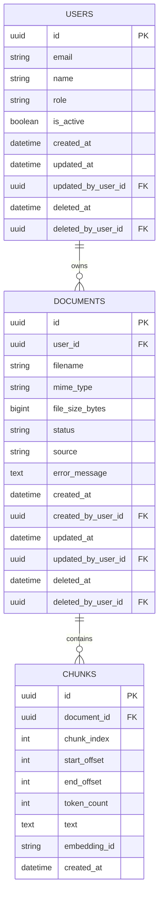

# Database Schema (ER Diagram)
This ER diagram describes the core relational structure for the RAG demo:
- `users`: system users (document owners, admins, audit)
- `documents`: uploaded files and their metadata
- `chunks`: text chunks generated from documents for retrieval



# 📊 Entity Relationships and Deletion Strategy Design

This document outlines the relationships between the three core entities in the RAG system: User, Document, and Chunk, as well as the adopted deletion strategy.

---
## 🔗 Entity Relationships

| Parent Entity | Child Entity | Relationship Description | Foreign Key Definition |
| :--- | :--- | :--- | :--- |
| `users` | `documents` | **One-to-Many**: A user owns many documents. | `documents.user_id` → `users.id` |
| `documents` | `chunks` | **One-to-Many**: A document contains many data chunks. | `chunks.document_id` → `documents.id` |
---

## 🗑️ Deletion Strategy

### 1. Hard Delete (Physical Deletion)

The following relationship utilizes **cascading physical deletion** to ensure strong consistency and retrieval performance between chunks and their parent document:

* **Document Deletion Cascade:** When a record in the `documents` table is **physically deleted**, all associated `chunks` records are automatically and permanently deleted by the database.
    * **Constraint:** `chunks.document_id` has the `ON DELETE CASCADE` attribute.

### 2. Soft Delete (Logical Deletion)

The following entities implement a **logical deletion** mechanism (soft delete) to retain history and support data recovery features:

| Entity | Logical Deletion Marker Columns | Purpose |
| :--- | :--- | :--- |
| `users` | `users.deleted_at` | Records the timestamp of deletion. Non-NULL indicates the record has been logically deleted. |
| `users` | `users.deleted_by_user_id` | Records the ID of the user who performed the deletion, for auditing. |
| `documents` | `documents.deleted_at` | Records the timestamp of deletion. Non-NULL indicates the record has been logically deleted. |
| `documents` | `documents.deleted_by_user_id` | Records the ID of the user who performed the deletion, for auditing. |

**Note:**
* When a `documents` record is **logically deleted** (i.e., updating `deleted_at`), its associated `chunks` are **not** automatically deleted.
* Application logic should simultaneously call the code to **physically delete** the associated `chunks` when a document is logically deleted, to maintain the performance of the RAG retrieval system.

## Table Definitions (DDL)
```sql
CREATE EXTENSION IF NOT EXISTS "pgcrypto";

CREATE TABLE users (
  id UUID PRIMARY KEY DEFAULT gen_random_uuid(),
  email VARCHAR(255) UNIQUE,
  name VARCHAR(100),
  role VARCHAR(20) NOT NULL DEFAULT 'user',  -- 'user' | 'admin'
  is_active BOOLEAN NOT NULL DEFAULT TRUE,
  created_at TIMESTAMPTZ NOT NULL DEFAULT NOW(),
  updated_at TIMESTAMPTZ NOT NULL DEFAULT NOW(),
  updated_by_user_id UUID NULL REFERENCES users(id),
  deleted_at TIMESTAMPTZ NULL,
  deleted_by_user_id UUID NULL REFERENCES users(id)
);


CREATE TABLE documents (
  id UUID PRIMARY KEY DEFAULT gen_random_uuid(),
  user_id UUID NOT NULL REFERENCES users(id),       -- document owner
  filename VARCHAR(255) NOT NULL,
  mime_type VARCHAR(100),
  file_size_bytes BIGINT,
  status VARCHAR(50) NOT NULL,                      -- uploaded | processing | ready | failed
  source VARCHAR(50) NOT NULL,                      -- upload | api | url
  error_message TEXT,
  created_at TIMESTAMPTZ NOT NULL DEFAULT NOW(),
  created_by_user_id UUID NULL REFERENCES users(id),
  updated_at TIMESTAMPTZ NOT NULL DEFAULT NOW(),
  updated_by_user_id UUID NULL REFERENCES users(id),
  deleted_at TIMESTAMPTZ NULL,
  deleted_by_user_id UUID NULL REFERENCES users(id)
);

CREATE TABLE chunks (
  id UUID PRIMARY KEY DEFAULT gen_random_uuid(),
  document_id UUID NOT NULL REFERENCES documents(id) ON DELETE CASCADE,
  chunk_index INT NOT NULL,
  start_offset INT,
  end_offset INT, 
  token_count INT,
  text TEXT NOT NULL,
  embedding_id VARCHAR(255), 
  created_at TIMESTAMPTZ NOT NULL DEFAULT NOW()
);

